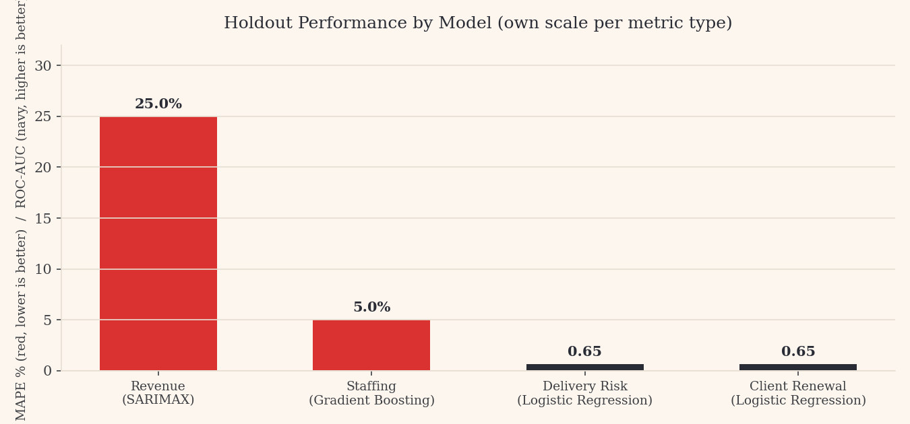
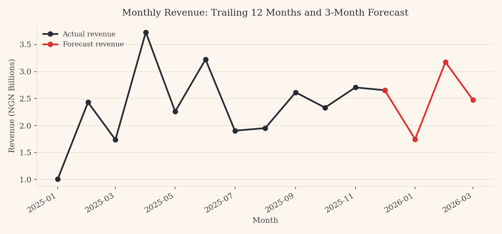

# ViisausPrime

Predictive business intelligence for internal operations, built as a Master's capstone project for Viisaus Technology Limited. Four models forecast revenue and staffing demand, and score every live project and recent client for risk, from the firm's own operational record.

**Live app:** [add your Streamlit link here once deployed]

## Dataset

**Engineered for academic use.** [`data/viisaus_operations_data.csv`](data/viisaus_operations_data.csv) was generated to mirror the structure, seasonality and business logic of a real operations dataset for a data and strategy consulting firm. It is not real company data, and no figures on this dashboard represent Viisaus Technology's actual financial or client performance.

1,897 project records · 60 months (Jan 2021 to Dec 2025) · 7 sectors · 19 fields

| Field | Description |
|---|---|
| `project_id`, `client_id` | Unique identifiers |
| `sector`, `service_line` | Business classification |
| `start_date`, `planned_end_date`, `actual_end_date` | Project timeline |
| `status` | Completed, Ongoing, or Cancelled |
| `complexity`, `team_size` | Delivery characteristics |
| `contract_value_ngn`, `actual_cost_ngn` | Financials |
| `delay_days`, `cost_overrun_pct` | Delivery outcomes |
| `client_satisfaction_score`, `renewed_within_12m` | Client outcomes |

## Method

- **Two problem types, two model families:** forecasting problems (revenue, staffing) were matched to time-series and gradient-boosted models. Classification problems (delivery risk, client renewal) were matched to models built to rank and prioritise, not just predict.
- **Every model was benchmarked, not assumed:** each candidate was tested against a simpler alternative and the winner was decided by a holdout the model never saw during training.
- **Leakage rules differ by prediction point:** the delivery risk model scores a project on day one, so it may only use day-one facts. The renewal model scores at project close, so it is legitimately allowed to use how the project actually went.
- **Percentage change, not raw level, for tree-based forecasts:** predicting the month-over-month change and rebuilding the level afterward avoids the ceiling a tree model hits when a value trends upward past its training range.

## Key Results

**Four different winners across four questions**, each decided by holdout performance, not by which technique sounds most advanced:



| Model | Technique | Metric | Result |
|---|---|---|---|
| Revenue forecast | SARIMAX | MAPE | ~25% |
| Staffing forecast | Gradient Boosting | MAPE | ~5% |
| Delivery risk | Logistic Regression | ROC-AUC | ~0.65 |
| Client renewal | Logistic Regression | ROC-AUC | ~0.65 |

Revenue, shown against its trailing 12 months:



The delivery risk and client renewal models both rank cases meaningfully better than chance, enough to prioritise a review list, not enough to treat as a verdict on any one project or client. Figures recalculate live from the loaded dataset and are reported in full on the app's Methodology page.

## Business Implications

- A firm's own project archive is usually enough to forecast revenue and staffing a full quarter ahead, without new data collection.
- Delivery risk and client attrition are visible before they become expensive, if leakage discipline is applied consistently.
- The right model is a function of the question, not a default choice. Two of four questions here were won by the simpler, more explainable model.

## Tech Stack

Python · pandas · NumPy · scikit-learn · statsmodels (SARIMAX) · Plotly · Streamlit

## Files

- `streamlit_app.py` — main app: layout, sidebar navigation, all seven pages
- `requirements.txt` — dependencies needed to run the app
- `data/viisaus_operations_data.csv` — the engineered operations dataset
- `src/config.py` — brand colours, file paths, app constants
- `src/data.py` — loading and reshaping the dataset, including the monthly staffing panel
- `src/models.py` — the four models, fully commented, with the leakage rules documented inline
- `src/charts.py` — branded Plotly chart helpers
- `assets/revenue_forecast.png` — chart used above
- `assets/model_comparison.png` — chart used above
- `DEPLOYMENT_GUIDE.md` — step-by-step deployment walkthrough

## How to Reproduce

```bash
git clone https://github.com/<your-username>/viisausprime.git
cd viisausprime
pip install -r requirements.txt
streamlit run streamlit_app.py
```

No API keys or external services required. The app runs entirely on the bundled CSV.

## Learnings

- **Tree models cannot extrapolate:** predicting percentage change instead of a raw trending value was the single most consequential decision in this project.
- **A holdout only protects you if it is chronological:** shuffling time-series data before splitting produces a flattering score that does not survive real forecasting.
- **Leakage is not one fixed rule:** the same field can be legitimate for one model and a leak for another, depending on when the prediction happens.
- **The best-sounding model does not always win:** Logistic Regression beat XGBoost on two of four questions. Reporting that honestly is more convincing than hiding it.

## Next Steps

- Connect a live extract from real systems, same 19-field structure, and re-validate before any score is used operationally.
- Re-test at weekly granularity, roughly quadrupling training rows.
- Extend the framework to a fifth question, likely sector-level demand trend.
- Add scheduled monthly retraining.

---

Built by Lois Opadeji | [LinkedIn](https://linkedin.com/in/loisopadeji) | [GitHub](https://github.com/)
